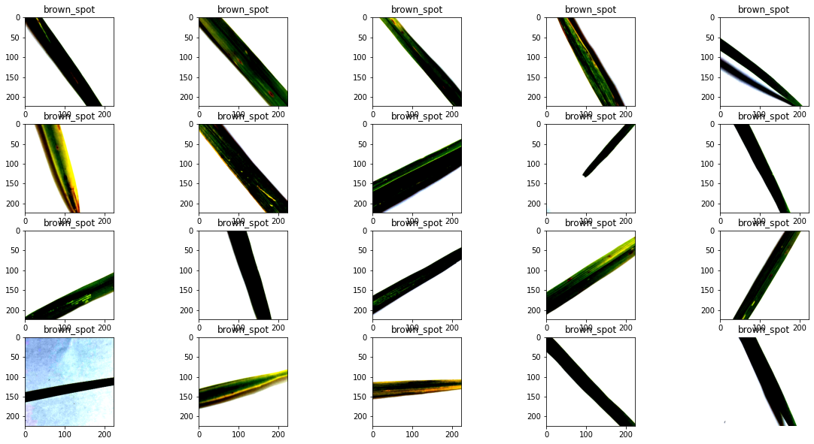
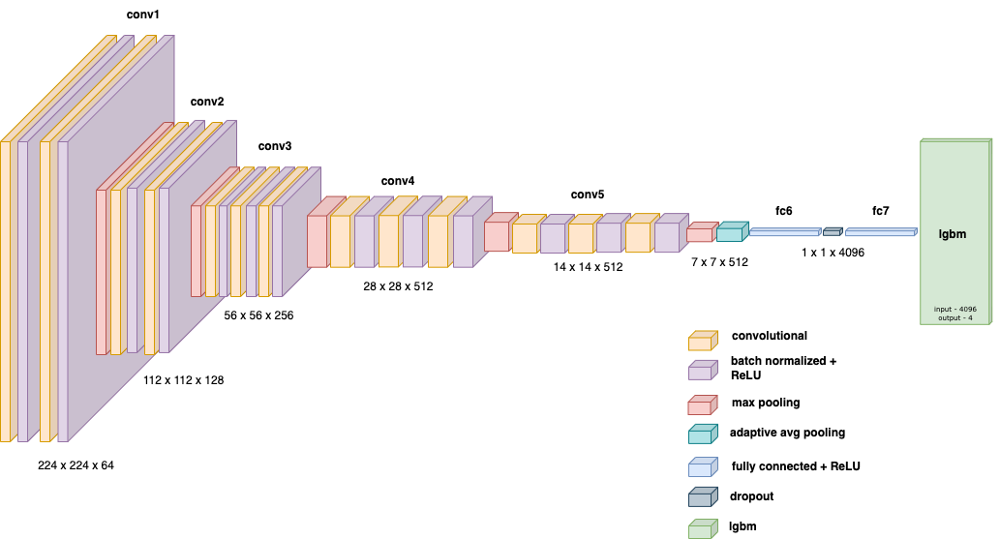
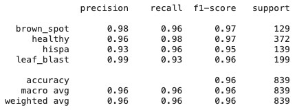
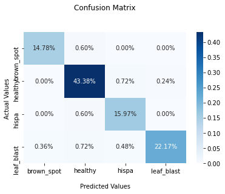
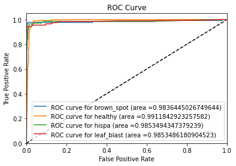
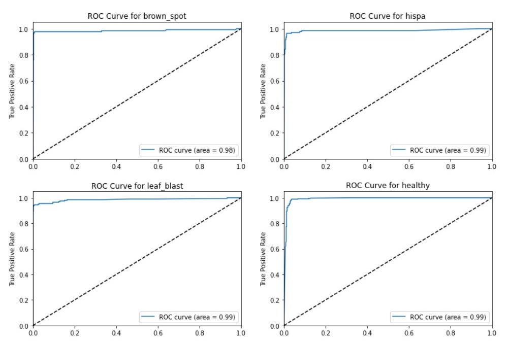
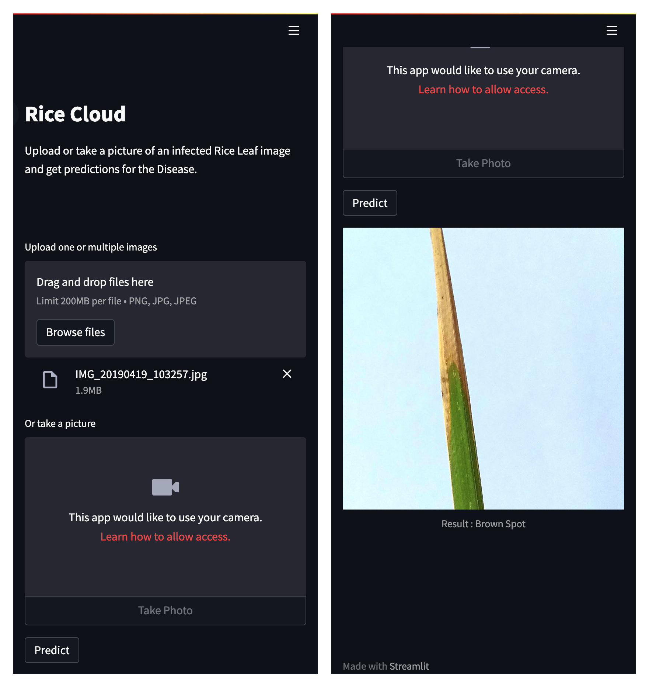

 
<h1> RiceCloud: A Cloud integrated Ensemble learning based Rice leaf Diseases prediction System </h1>

[Abhimanyu Bhowmik](https://scholar.google.com/citations?user=r3bzJ7oAAAAJ&hl=en), [Madhushree Sannigrahi](https://scholar.google.com/citations?user=Mtnm7igAAAAJ&hl=en), [Deepraj Chowdhury](https://scholar.google.com/citations?user=9sZgeV4AAAAJ&hl=en), [Debanjan Das](https://scholar.google.com/citations?hl=en&user=ss7qwk4AAAAJ)

[](https://doi.org/10.1109/INDICON56171.2022.10039790) 
[](https://www.kaggle.com/datasets/shayanriyaz/riceleafs) 
[](https://github.com/abhimanyubhowmik/RiceCloud/tree/main/Model)
[](https://docs.google.com/presentation/d/1gvCsCyNCn75RjuJnyyVfNFqU01OW1PKzvIrtb3buVqM/edit?usp=sharing) 
[](https://abhimanyubhowmik-ricecloud-appmain-ryht61.streamlitapp.com/)
[](https://ricecloud.herokuapp.com)


> **Abstract:** *Rice is one of the primary food items consumed by the humans. Farmers in developing countries like India face a lot of problems while cultivating the rice crop. One of such major problem is of rice leaf disease. A plethora of research has been carried out by the data scientist and machine learning expert to detect the disease of the rice leaf from the images. In the research, researchers had mostly used deep learning techniques to detect the rice leaf disease. In this paper, an ensemble learning architecture has been proposed, where the image is given input to a very famous transfer learning neural network, VGG 16 which is pretrained with ImageNet dataset and the features from the penultimate layer is considered as a input to the Light GBM. The Ensemble learning model is deployed on Heroku with a end to end user interface that can be accessed from mobile. The proposed method has given an accuracy of 96.49% , where trained with 80% images of dataset and validated on rest 20% while classifying 4 types of rice leaf disease.*

<hr />

<h2>About Dataset</h2>

<h3>Context</h3>

Shayan Riyaz found this dataset when it was not uploaded on Kaggle and was scattered across the internet. This dataset is a collection of multiple data sets that can be found online. The size of this dataset is ~ 7 GB due to the high resolution of images. The number of images in the dataset is
3355 `.jpg` files.

<h3>Content</h3>

The dataset has been divided into two groups, `train` and `validation`.
Inside the two folders are 4 categories of types:

* BrownSpot
* Healthy
* Hispa
* LeafBlast

**Note:** The image resolution in the images is not uniform.

Sample Images from the dataset can be found in the the folder `./Sample Images`.


<h2>Proposed Methods</h2>


<!--
  ======================Global Architecture===========================
                          -->

<h3>1. Globar Architecture</h3>


<br><br>

<div align="center">

<p>Conceptual view of the proposed architecture </p>
</div>

<br>

<!--
  =========================Data Preprocessing========================= 
                          -->
 

<h3>2. Data Preprocessing</h3>


<div align="center">

<p>Preprocessed Image Sample for BrownSpot class </p>
</div>

<br>


<!--
  ============================Model=========================
                          -->

<h3>3. Proposed Model </h3>


<div align="center">

<p>Proposed model Architecture </p>
</div>

<br>


<!--
  ====================================RESULTS===============================
                          -->

<h2>Results </h2>
<h3>1. Classification Report</h3>

<div align="center">

<p>Classification report for 75:25 train-validation ratio</p>
</div>


<h3>2. Confusion Matrix</h3>

<div align="center">

<p>Confusion Matrix: All the classes</p>
</div>
<br><br>

<h3>3. ROC - AUC Curves</h3>

<div align="center">
<table>
  <tr>
    <td width="50%"> <br>(a) </td>
    <td width="50%"> <br>(b) </td>
  </tr>
</table>
<p>(a), (b) Globar Receiver operating characteristic Curve (left) ROC curves for indevisual classes (right).</p>
</div>
<br><br>

<h3>4. RiceCloud: Application UI</h3>

<div align="center">

<p>UI of deployed application using Streamlit</p>
</div>
<br><br>


<hr />

<h2>Cite our work</h2>

    
```bibtex

@INPROCEEDINGS{10039790,
  author={Bhowmik, Abhimanyu and Sannigrahi, Madhushree and Chowdhury, Deepraj and Das, Debanjan},
  booktitle={2022 IEEE 19th India Council International Conference (INDICON)}, 
  title={RiceCloud: A Cloud integrated Ensemble learning based Rice leaf Diseases Prediction System}, 
  year={2022},
  volume={},
  number={},
  pages={1-6},
  doi={10.1109/INDICON56171.2022.10039790}}

```


<hr />

<h2>Contact</h2>
For any queries, please contact: <a href="mailto:bhowmikabhimnayu@gmail.com">bhowmikabhimnayu@gmail.com</a>